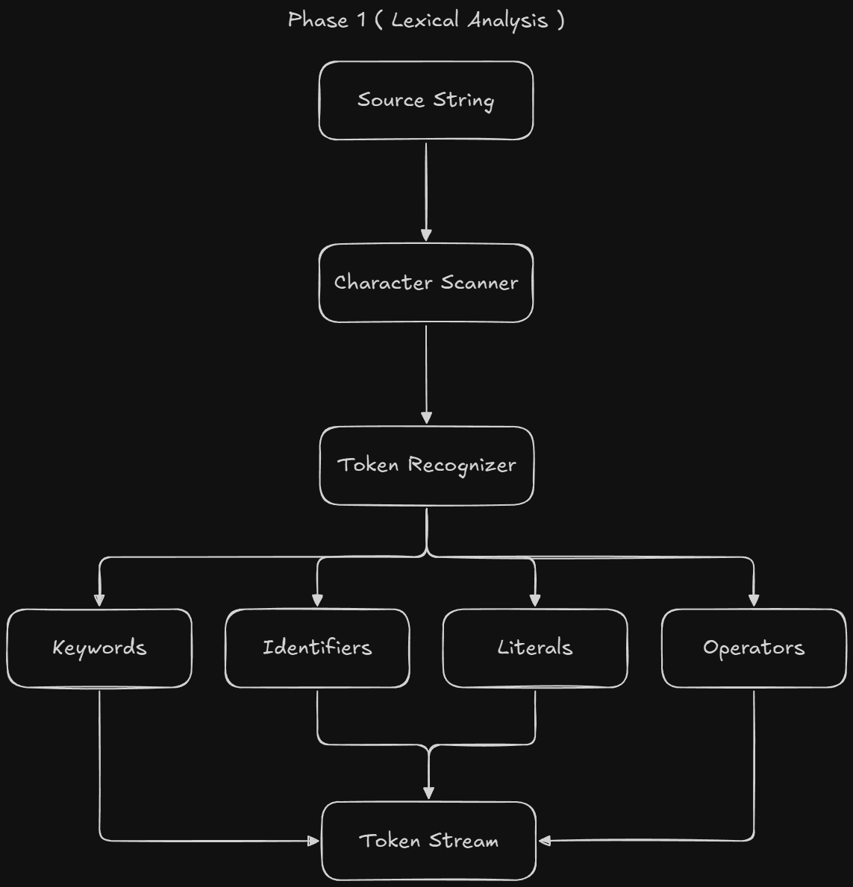
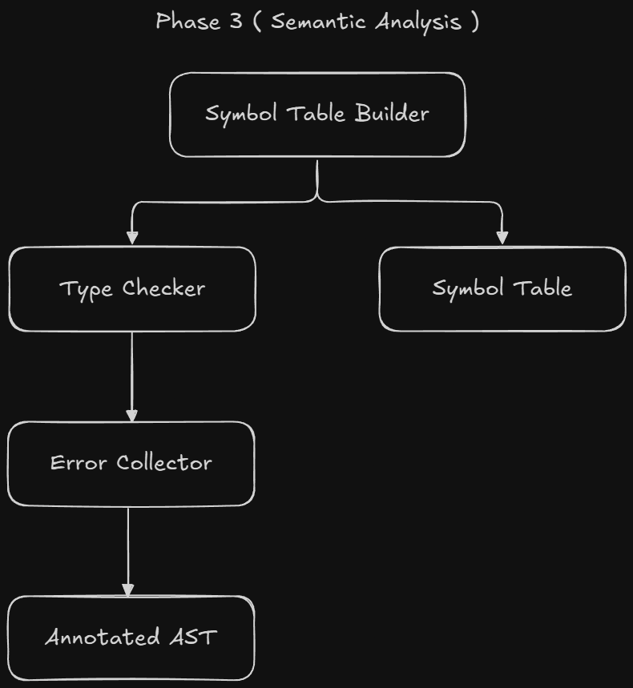
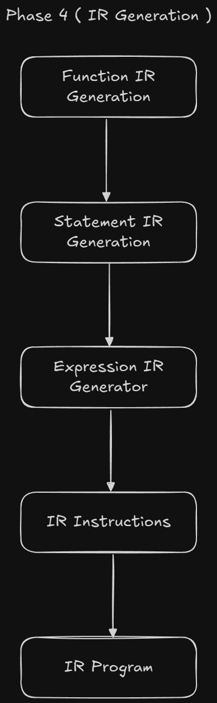
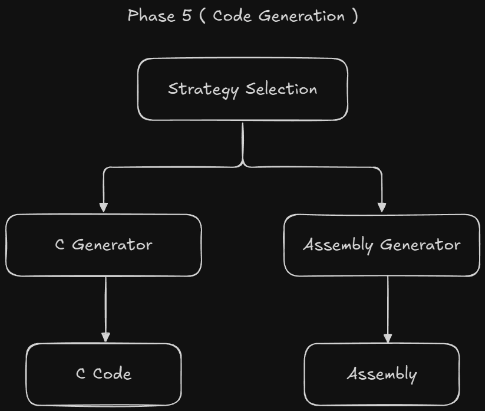

# Twinkies


## Project Structure / Flow

More diagrams in the `Twinkies-Flow` folder.

### PHASE 1
<p align="center">
  
</p>

### PHASE 2
<p align="center">
  
</p>

### PHASE 3
<p align="center">
  
</p>

### PHASE 4
<p align="center">
  
</p>

### PHASE 5
<p align="center">
  
</p>

## Features

- **Static typing** with type inference
- **C-like syntax** that's familiar and easy to learn
- **FFI support** for calling external libraries
- **Inline Assembly** with GCC-style syntax
- **Module system** with header files
- **Multiple output formats** - transpile to C or compile to assembly
- **Built-in debugging** tools and memory profiling
- **VS Code syntax highlighting** extension included

## Language Overview

```twink
func main() -> int {
    let message: string = "Hello, World!";
    let numbers: int[5];
    
    numbers[0] = 1;
    numbers[1] = 2;
    numbers[2] = 3;
    numbers[3] = 4;
    numbers[4] = 5;
    
    print(message);
    
    let i: int = 0;
    while (i < 5) {
        print("Number:", numbers[i]);
        i = i + 1;
    }
    
    return 0;
}
```

### FFI Example
```twink
extern "cdecl" from "kernel32.dll" {
    func GetTickCount() -> int;
}

func main() -> int {
    let ticks: int = GetTickCount();
    print("System ticks:", ticks);
    return 0;
}
```

## Building

```bash
make all        
make debug       
make release      
```

## Usage

```bash
# Compile to C
./compiler input.tl -o output.c

# Compile to assembly (experimental)
./compiler input.tl -o output.s --asm

# Debug options
./compiler input.tl -o output.c --debug --verbose
```

### Compiler Options

- `-o <file>` - Specify output file
- `--asm` - Generate assembly output
- `--modules` - Enable module system
- `--debug` - Enable debug output
- `--verbose` - Verbose compilation
- `--tokens` - Print token stream
- `--ast` - Print abstract syntax tree
- `--ir` - Print intermediate representation

## Examples

The `examples/` directory contains sample programs:

- `basic/` - Simple programs demonstrating language features
- `advanced/` - Complex examples with arrays, functions, and control flow
- `ffi/` - Foreign function interface examples
- `modules/` - Module system demonstrations
- `debugging/` - Error handling and debugging examples

## VS Code Extension

Install the included syntax highlighter from `TwinkSyntax/twink-syntax-0.0.2.vsix` for full language support in VS Code.
